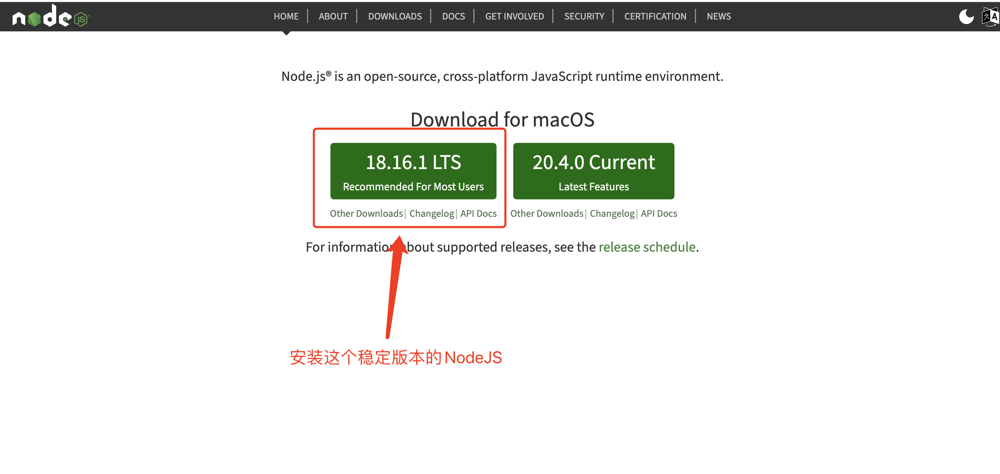
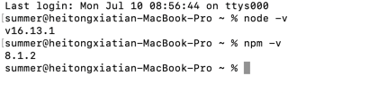
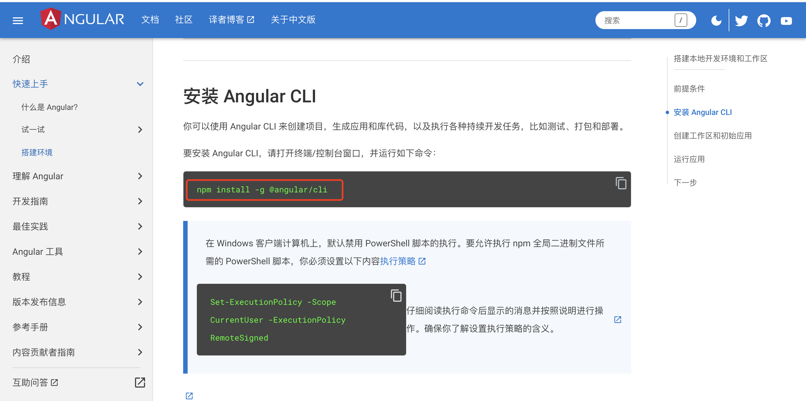
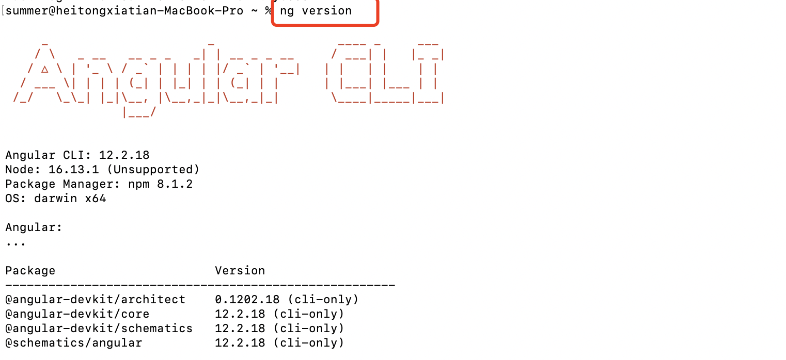
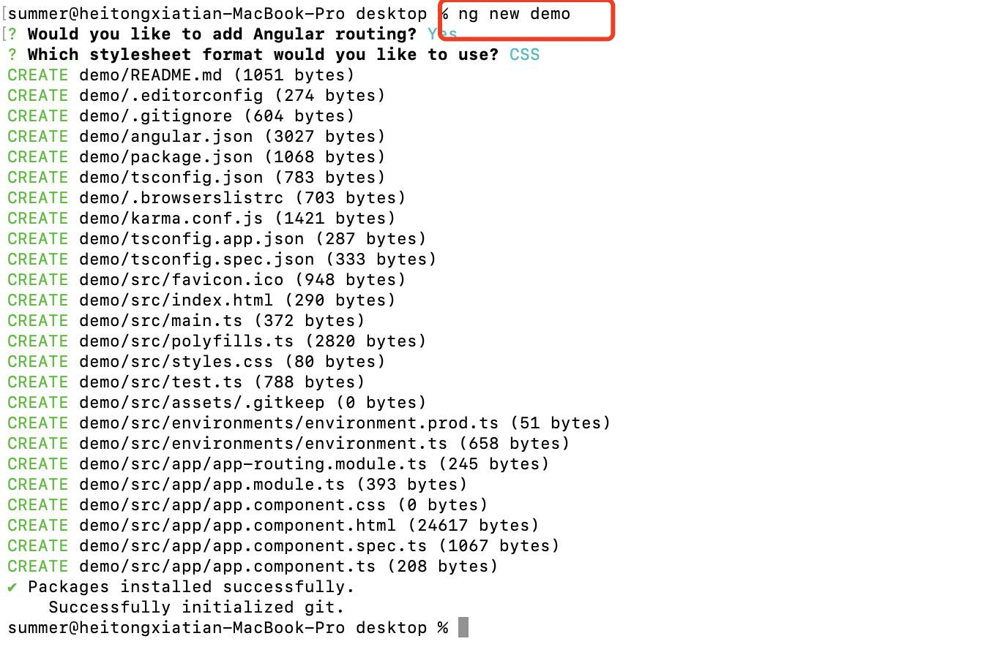
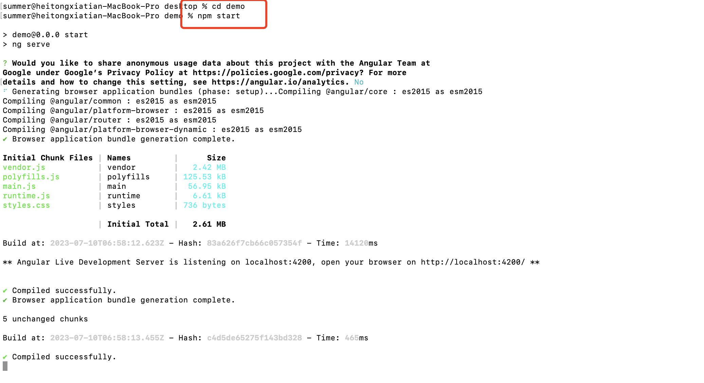
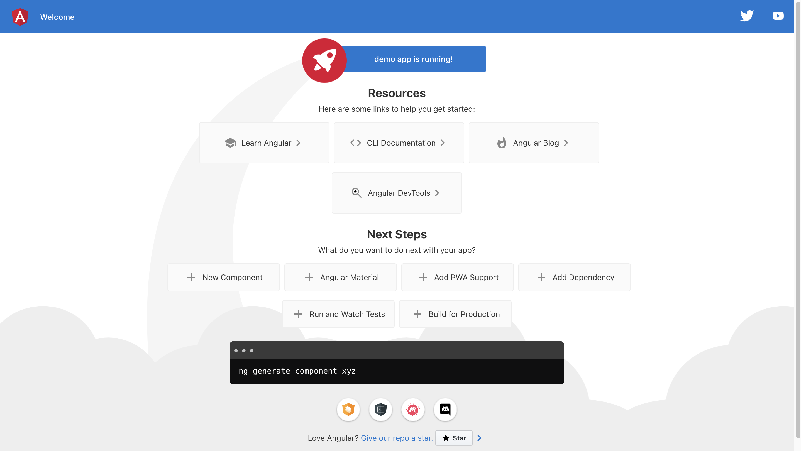

# Angular前端环境配置

## 1. 安装NodeJS
打开NodeJS官网 `https://nodejs.org/en`  

  

检查是否安装成功 在Dos命令中输入`node -v`和`npm -v` 能出现版本号就代表已经安装成功  

## 2. 设置NPM的网络代理
在Dos命令中输入 `npm config set registry https://registry.npm.taobao.org/`  

  

检查是否安装成功 在Dos命令中输入`npm config get registry` 能出现仓库地址就代表已经安装成功

## 3. 安装Angular脚手架
安装Angular脚手架 `npm install -g @angular/cli`  

  

检查是否安装成功 在Dos命令中输入`ng version` 能出现版本号就代表已经安装成功  

## 4. 创建一个Angular项目
在Dos命令中 输入`ng new demo` 来创建一个新的Angular项目  

  

进入到这个目录 `cd demo`

## 5. 启动Angular项目
在Dos命令中 输入`npm start` 来启动Angular项目  

  

启动成功之后,打开浏览器,在浏览器上输入 `http://localhost:4200/` 出现如下界面

  

代表已经运行成功 至此NodeJS和Angular环境已经全部安装完成

