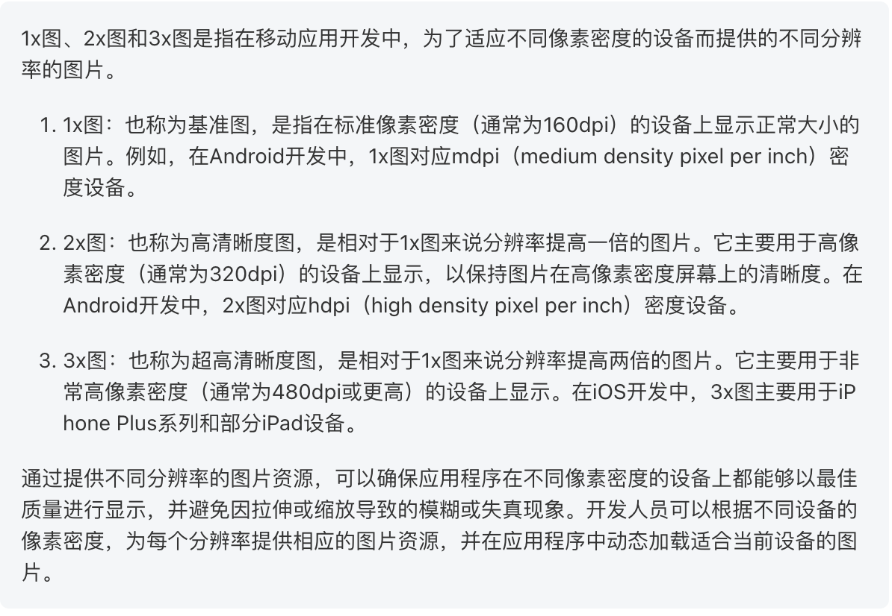
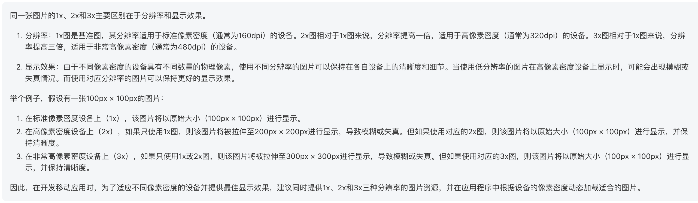

# Flutter Android和Ios手机桌面图标和启动页尺寸详解

在Flutter开发中,根据手机的像素密度的不同，因此需要提供的图片大小大致可以分为3种类型的图片
`1x图 2x图 3x图`

  

  

## 手机桌面图标
### 在Ios端,需要提供以下几种格式的图片:  

| 图片尺寸           | 1x               | 2x            | 2x             |
|:---------------|:-----------------|:--------------|:---------------|
| 20 x 20        | 20 x 20          | 40 x 40       | 60 x 60        |
| 29 x 29        | 29 x 29          | 58 x 58       | 87 x 87        |
| 40 x 40        | 40 x 40          | 80 x 80       | 120 x 120      |
| 60 x 60        |                  | 120 x 120     | 180 x 180      |
| 76 x 76        | 76 x 76          | 152 x 152     |                |
| 83.5 x 83.5    |                  | 167 x 167     |                |
| 1024 x 1024    | 1024 x 1024      |               |                |

### 在Android端,需要提供以下几种格式的图片:  

| 图片存放目录            | 图片尺寸           |
|-------------------|----------------|
| mipmap-mdpi       | 48 x 48        |
| mipmap-hdpi       | 72 x 72        |
| mipmap-xhdpi      | 96 x 96        |
| mipmap-xxhdpi     | 144 x 144      |
| mipmap-xxxhdpi    | 192 x 192      |

## 启动页面背景图
### 在Ios端,需要提供以下几种格式的图片:  

| 图片尺寸                |
|:--------------------|
| 720 x 1280          |
| 1080*1920           |
| 1440 x 2560         |

### 在Android端,需要提供以下几种格式的图片:  

| 图片存放目录             | 图片尺寸               |
|--------------------|--------------------|
| mipmap-mdpi        | 320 x 480          |
| mipmap-hdpi        | 480 x 800          |
| mipmap-xhdpi       | 720 x 1280         |
| mipmap-xxhdpi      | 1080 x 1920        |
| mipmap-xxxhdpi     | 1440 x 2560        |
